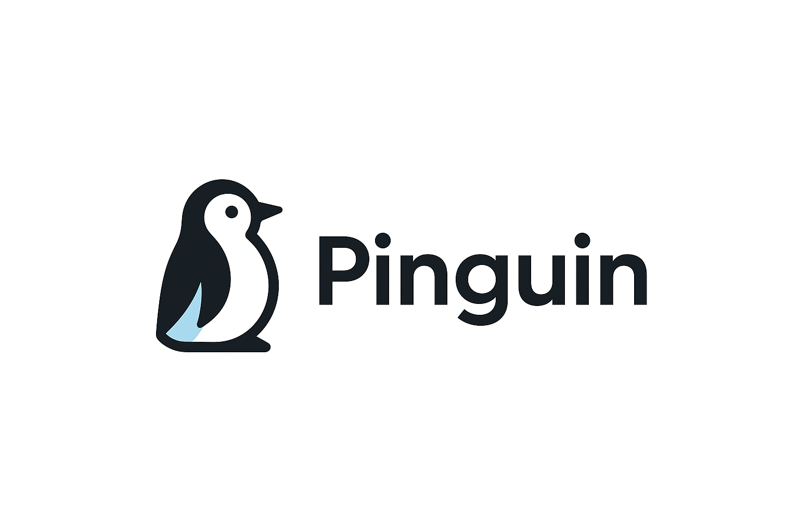
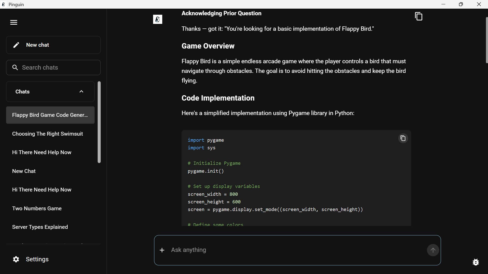

# Pinguin

[](LICENSE)
[](https://github.com/Kehn-Marv/Pinguin/releases)
[](https://github.com/Kehn-Marv/Pinguin)
[](https://github.com/Kehn-Marv/Pinguin)
[](https://www.arm.com/)
[](https://github.com/Kehn-Marv/Pinguin)

**A powerful, privacy-first AI study companion optimized for Arm-based devices. Study faster, think deeper, learn privately.**

<p align="center">
  
</p>

<p align="center">
  
</p>

## Overview

Pinguin is an offline-first AI study companion built specifically for university students who value privacy and performance. Running entirely on-device with Arm-optimized AI models, Pinguin transforms your study materials into an intelligent knowledge base you can query naturally—no internet required, no data leaving your device.

**Why Pinguin for Arm?**
- **Native Arm64 Performance**: Built and optimized specifically for Arm architecture, leveraging efficient instruction sets for faster inference
- **On-Device AI**: All processing happens locally using Ollama's Arm-native builds—your data never leaves your device
- **Energy Efficient**: Arm's power efficiency means longer battery life during study sessions
- **Cross-Platform**: Runs on Windows on Arm, macOS (Apple Silicon), and Linux Arm devices

## Key Features

### Intelligent Document Processing
- **Multi-Format Support**: PDF, DOCX, EPUB, TXT, and more
- **OCR for Scanned Documents**: Extract text from images and scanned PDFs using Tesseract
- **Smart Chunking**: Advanced text segmentation preserves context and meaning
- **Metadata Extraction**: Automatic extraction of document structure and metadata

### RAG-Powered Q&A
- **Semantic Search**: Vector-based retrieval finds relevant information across all your documents
- **Context-Aware Responses**: LLM generates answers grounded in your study materials
- **Source Attribution**: Every answer includes references to source documents
- **Multiple Query Modes**: Optimize for precision, recall, or balanced retrieval

### Privacy & Performance
- **100% Offline**: No internet connection required after initial setup
- **Local AI Models**: Ollama runs LLMs and embeddings entirely on your device
- **Fast Inference**: Arm-optimized models deliver quick responses
- **Secure Storage**: ChromaDB vector store keeps your data local and encrypted

### Student-Focused Design
- **Course Organization**: Group documents by courses and subjects
- **Chat History**: Review past conversations and insights
- **Batch Processing**: Upload multiple documents at once
- **Clean Interface**: Distraction-free UI built with Material-UI

## Technical Architecture

Pinguin leverages a modern, efficient tech stack optimized for Arm devices:

**Frontend**
- Electron (Arm64 native builds)
- React 18 with TypeScript
- Material-UI for responsive design

**Backend**
- Python FastAPI server
- LangChain for RAG orchestration
- ChromaDB vector database
- Ollama for local LLM inference

**AI Models**
- Embedding models: nomic-embed-text, mxbai-embed-large
- LLMs: llama3.2, qwen2.5, phi3, and more
- All models run via Ollama's Arm-native builds

**Document Processing**
- Tesseract OCR (Arm64 builds)
- Poppler PDF utilities
- Custom extractors for various formats

## Quick Start

### Prerequisites
- **Arm-based Device**: Windows on Arm, macOS (Apple Silicon), or Linux Arm64
- **Ollama**: Download from [ollama.com](https://ollama.com) (Arm builds available)
- **4GB+ RAM**: Recommended for optimal performance
- **5GB+ Storage**: For models and document storage

### Installation

1. **Download Pinguin**
   - Get the latest Arm64 installer from [GitHub Releases](https://github.com/Kehn-Marv/Pinguin/releases)
   - For Windows on Arm: `Pinguin-Setup-1.0.0-arm64.exe`

2. **Install Ollama**
   ```bash
   # Visit ollama.com and download the Arm version for your OS
   # Windows on Arm: Download and run the installer
   # macOS (Apple Silicon): brew install ollama
   # Linux Arm64: curl -fsSL https://ollama.com/install.sh | sh
   ```

3. **Run Pinguin Installer**
   - Double-click the installer and follow the prompts
   - Pinguin will automatically detect Ollama on first launch

4. **First-Run Setup**
   - Select your preferred LLM (e.g., llama3.2:3b for speed, llama3.2:7b for quality)
   - Choose an embedding model (nomic-embed-text recommended)
   - Models will download automatically via Ollama

5. **Start Learning**
   - Upload your study materials (PDFs, documents, notes)
   - Ask questions and get AI-powered answers from your content

## Building from Source

Detailed build instructions for Arm devices are available in [docs/ARM_BUILD_GUIDE.md](docs/ARM_BUILD_GUIDE.md).

```bash
# Clone the repository
git clone https://github.com/Kehn-Marv/Pinguin.git
cd Pinguin

# Install dependencies
npm install
cd backend && pip install -r requirements.txt && cd ..

# Build for Arm64
npm run make
```

## Known Issues and Limitations

Pinguin is actively being improved. Current known issues:

- **First Query Latency**: Initial queries may take 1-2 minutes as models load into memory. Subsequent queries are faster (30-50 seconds depending on complexity).
- **UI State Sync**: Occasional UI glitches with message display. Workaround: Navigate between chats to refresh state. Fix planned for v1.1.
- **Scanned Document Processing**: OCR processing can take 20-30 minutes for large scanned PDFs. For best experience, use text-based PDFs when possible.
- **File Format Support**: Currently supports PDF, DOCX, EPUB, and TXT. Additional formats coming in future releases.

See [KNOWN_ISSUES.md](KNOWN_ISSUES.md) for details and workarounds.

## Documentation

- [Technical Documentation](docs/TECHNICAL.md) - Architecture and implementation details
- [Arm Build Guide](docs/ARM_BUILD_GUIDE.md) - Building and optimizing for Arm devices
- [API Reference](docs/API.md) - Backend API documentation
- [Known Issues](KNOWN_ISSUES.md) - Current limitations and workarounds
- [Contributing Guide](CONTRIBUTING.md) - How to contribute to Pinguin

## Performance on Arm

Pinguin is optimized for Arm architecture and delivers excellent performance:

- **Fast Startup**: < 5 seconds on modern Arm devices
- **Quick Inference**: 20-50 tokens/second with 3B models on Arm CPUs
- **Efficient Memory**: Runs comfortably in 4GB RAM
- **Low Power**: Extended battery life thanks to Arm efficiency
- **Native Builds**: All components compiled for Arm64

## Use Cases

- **Exam Preparation**: Query your lecture notes and textbooks instantly
- **Research**: Quickly find relevant information across multiple papers
- **Note Organization**: Transform scattered notes into a searchable knowledge base
- **Language Learning**: Practice with AI using your own learning materials
- **Professional Development**: Build a personal knowledge base from courses and books

## Contributing

We welcome contributions! Pinguin is open source and built for the community.

See [CONTRIBUTING.md](CONTRIBUTING.md) for guidelines on:
- Reporting bugs
- Suggesting features
- Submitting pull requests
- Code style and standards

## License

Pinguin is licensed under the MIT License. See [LICENSE](LICENSE) for details.

## Acknowledgments

Built with love for the Arm AI Developer Challenge 2025.

Special thanks to:
- [Ollama](https://ollama.com) for making local AI accessible
- [LangChain](https://langchain.com) for RAG infrastructure
- [ChromaDB](https://www.trychroma.com/) for vector storage
- The Arm developer community

## Contact

**Developer**: Kehn Marv  
**Email**: kehnmarv30@gmail.com  
**Repository**: [github.com/Kehn-Marv/Pinguin](https://github.com/Kehn-Marv/Pinguin)

---

Made with passion for students who value privacy and performance.
